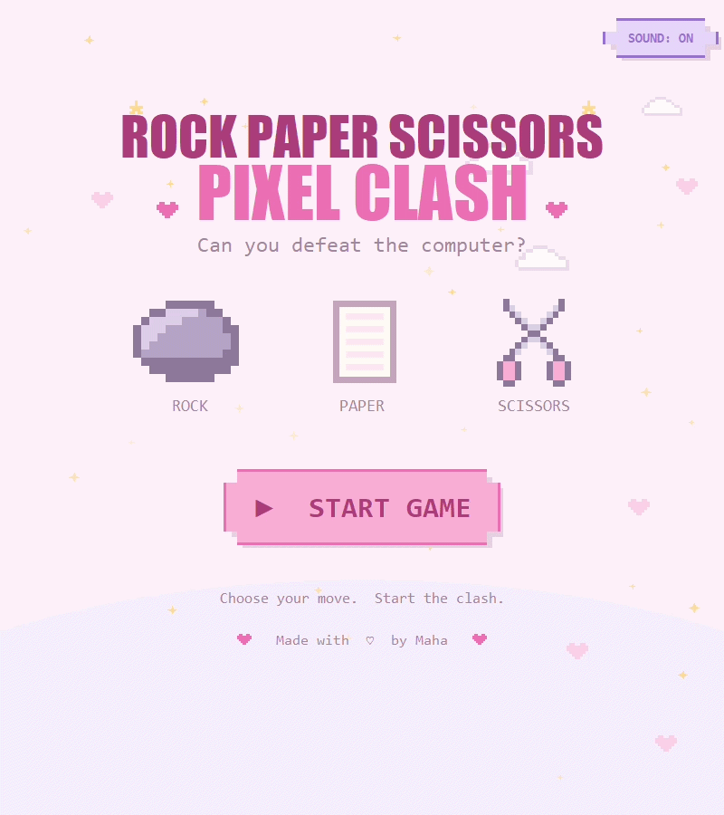

<div align="center">

# 🪨 Rock Paper Scissors: Pixel Clash ✨

_A cozy pastel pixel-art twist on a classic game._

</div>

<p align="right">
  A charming desktop Rock–Paper–Scissors game with animated screens, pixel sprites, tiny chiptune sounds, and a very determined computer opponent. Made with 💗 by Maha.
  <br><br>
  
  
  
</p>

---

## 🌸 A little intro

**Pixel Clash** turns Rock–Paper–Scissors into a tiny pastel arcade experience. Pick your move, face the computer, and play a best-of-3, 5, or 7 match. Every screen has its own personality—from floating hearts and sparkles to victory confetti and rainy defeat scenes.

## 🧰 Technologies

| Technology                 | What it does                                                               |
| -------------------------- | -------------------------------------------------------------------------- |
| **Python**                 | Powers the game logic, animation, sound, and app flow.                     |
| **Tkinter**                | Draws the interactive canvas-based game interface.                         |
| **CustomTkinter**          | Creates the desktop window and themed container.                           |
| **winsound / simpleaudio** | Plays the tiny chiptune-style sound effects.                               |
| **Canvas API**             | Makes the pixel panels, animations, particles, and hover effects possible. |

## ✨ Features

- 🎮 Play best-of-**3, 5, or 7** rounds.
- 🪨 Choose between animated **rock, paper, and scissors** cards.
- 🤖 Play against a computer opponent with random moves.
- 🌟 Enjoy sparkles, confetti, floating hearts, rain, and pixel-art characters.
- 🔊 Hear short sound effects for hovering, clicks, countdowns, moves, and results.
- 🔇 Toggle sound from any screen with the **SOUND: ON/OFF** button.
- 🏆 Get a different ending for victory, defeat, or a draw.
- 🧪 Run a complete headless gameplay check without opening the window.

## ⌨️ Keyboard shortcuts

| Key   | Action         |
| ----- | -------------- |
| `Esc` | Quit the game. |

> Most of Pixel Clash is mouse-friendly: hover over a button for a tiny chirp, then click to play.

## 🧠 The process

1. Started with the Rock–Paper–Scissors rules and a score system.
2. Split the game into separate screens: welcome, round selection, gameplay, and results.
3. Built reusable canvas components for buttons, panels, text pops, and sprites.
4. Added animation timing, particle effects, and different moods for winning and losing.
5. Added gentle sound effects and a global sound toggle.
6. Tested the complete game flow with a headless automated check.

## 🏗️ How it is built

The project keeps game rules separate from the visuals so the important logic is easy to test and change.

```text
main.py
  └── app.py                 window + screen transitions
      ├── screens/welcome.py welcome screen
      ├── screens/rounds.py  round picker
      ├── screens/gameplay.py match flow and countdown
      └── screens/results.py victory, defeat, and draw screens

game.py                      Rock–Paper–Scissors rules and score state
ui.py                        reusable canvas buttons and panels
anim.py + fx.py              animation clock, particles, backgrounds
sprites.py + assets.py       pixel sprites, images, and fonts
audio.py                     sound effects and mute control
```

## 🌱 What I learned

- How to structure a small Python game into focused, reusable files.
- How to use a `tk.Canvas` for custom interactive UI instead of standard buttons.
- How to create smooth animation without freezing the interface.
- How to handle screen changes cleanly and cancel old timers safely.
- How to design simple sound effects that add personality without overwhelming the player.
- Why separating game rules from the UI makes testing much easier.

## 💡 Ideas for future improvements

- Add difficulty levels with smarter computer choices.
- Save player wins, losses, and streaks between sessions.
- Add a name picker and a personal high-score board.
- Let players choose a colour theme or unlock new sprite packs.
- Add accessibility settings, including larger text and reduced-motion mode.
- Package the game as a standalone Windows app.

## 🚀 Run the project

```bash
# Clone your copy of the project
git clone https://github.com/YOUR-USERNAME/pixel_clash.git
cd pixel_clash

# Create and activate a virtual environment
python -m venv .venv
.venv\Scripts\activate

# Install the dependency and start the game
pip install -r requirements.txt
python main.py
```

On macOS/Linux, activate the environment with:

```bash
source .venv/bin/activate
```

> **Custom assets:** add your own PNGs in `assets/images/`, fonts in `assets/fonts/`, or WAV sounds in `assets/sounds/` to customise the game.

## 🎬 Live gameplay



_Click the link to see a real round of Pixel Clash, including its animations and sound effects._

---

<div align="center">

Made with ✨, pixels, and a little bit of friendly competition.

</div>
